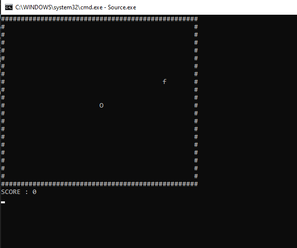

# Snake-Game
made a simple snake game in cpp you can also play this game in your own terminal
learned alot of concepts on how to render a simple yet complex game in terminal

# run on your own device 
clone or download zip

make sure that you have gcc installed 
    - type gcc --version
    - if gcc 6.3.0  or higher you are good to go

open your terminal 
    - windowsKey + r
    - write cmd and enter
    - go to the location were you have downloaded this folder

once you reach in you location 
    - **cd "c:\Users\admin\OneDrive\Desktop\Coding\FunProject\snakeGame\" ; if ($?) { g++ Source.cpp -o Source } ; if ($?) { .\Source }**
    - make sure to copy paste the above code without any space and hit enter

# Game screen
 

you can exit the game by using **crt + c** 

# Have Fun 